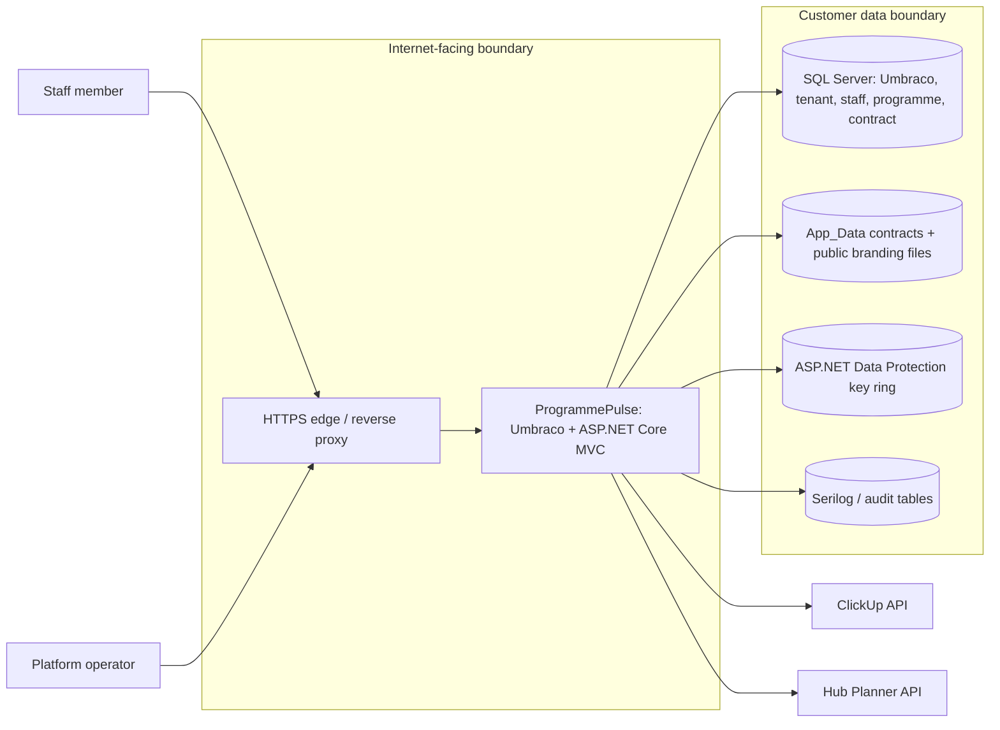
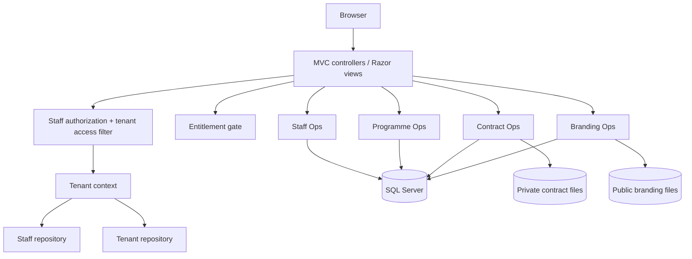
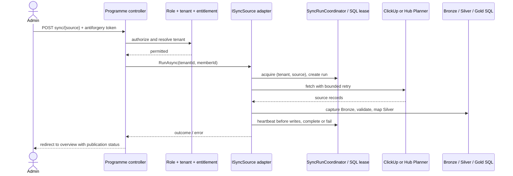

# Architecture and GTM review — 19 September 2026

## Decision and scope

**Controlled pilot: conditional go. Open self-service SaaS: no-go.** This is a source and test-harness review, not a production load test, live penetration test, or customer acceptance test. It covers the current Umbraco 18 / .NET 10 monolith, SQL Server persistence, ClickUp and Hub Planner ingestion, staff and tenant authorization, contract storage, CI, and operator flows. The release-readiness and persona-gate documents contain earlier observations; their historical test counts are not current-run evidence.

The assessment uses the [Azure Well-Architected Framework](https://learn.microsoft.com/en-us/azure/well-architected/what-is-well-architected-framework) pillars and [OWASP ASVS](https://owasp.org/projects/asvs/) as review lenses. The diagrams below describe code in this repository; boxes marked **target** are recommendations, not deployed components.

## 1. System context and trust boundaries

**Evidence:** `Program.cs` owns middleware, health probes and MFA pending cookie; `Composers/` wires domain services; `TenantContextAccessor` resolves the tenant from the signed-in member's staff profile; `ContractDocumentStorageService` stores outside `wwwroot`; `BrandingAssetStorageService` stores public raster assets under `wwwroot`; `ProgrammeOperationsComposer` configures outbound clients and Data Protection. The edge, SQL hosting, key ring and log sink are deployment dependencies, not assets provisioned by this repository.

**Security boundary:** `/staffops` actions combine member authentication, active staff profile, role, tenant resolution, plan entitlement and record ownership. `/umbraco` is a separate administrative surface. `/opshwb` is an anonymous demo surface. An edge rule for `/umbraco` is still a deployment gate; role checks inside `/staffops` do not protect it.

## 2. Runtime modules and request path

The modular monolith is a reasonable pilot shape: feature composers and interfaces give useful boundaries without distributed deployment overhead. The main coupling remains shared SQL schema, shared member groups and one web process. `StaffReportingController` has many unrelated read and write actions, so capability changes are difficult to review. Split it by report and command area after the persona permission contract is established; preserve routes and regression tests during extraction.

The scoped `StaffAuthorizationService` now reuses its active-profile lookup within one request. That reduces repeated member and staff SQL reads from multi-predicate pages while retaining a fresh check on the next request. It must remain scoped in `StaffOperationsComposer`.

## 3. Ingestion, publication and data meaning

`ISyncSource` and `SyncSourceRegistry` keep the controller source neutral. `SyncRunCoordinator` adds a database lease and fencing; Silver writes are tenant keyed. The current request waits for the whole sync. A proxy timeout, disconnect or process restart can interrupt a run; a failed run can leave valid but partial Silver writes. The overview exposes partial-publication language, which is essential to honest customer reporting. Planned Hub Planner bookings remain separate from completed work, and unresolved identities are surfaced instead of silently assigned.

**Target migration:** add a durable `(tenant, source, requestedBy, idempotencyKey)` work item in SQL, return `202 Accepted` with a run URL, and run a bounded worker that owns a DI scope. Reuse the current lease, stage updates, audit and status query. Add cancellation, restart recovery, queue depth and age alarms, and a test that a process restart resumes or explicitly fails the queued item. Do not start with `Task.Run` from the request: it loses lifetime and recovery guarantees. The [ASP.NET Core hosted-service guidance](https://learn.microsoft.com/en-us/aspnet/core/fundamentals/host/hosted-services?view=aspnetcore-10.0) is a reference for worker lifetime; durable state is still an application requirement.

## 4. Findings and GTM gates

| Priority | Finding and evidence | Consequence | Required exit evidence |
|---|---|---|---|
| P0 | Persona integration tests use LocalDB and can return without assertions when LocalDB is unavailable (`ProgrammePulseWebApplicationFactory`, persona gate notes). | CI can appear green without exercising the real HTTP authorization path. | A CI job with SQL Server that runs persona and cross-tenant HTTP journeys; an unavailable dependency produces **inconclusive/fail**, never pass. |
| P0 | `/umbraco` remains on the public host (`Program.cs`, release-readiness R24). | A second privileged entry point is exposed. | Edge allowlist or separate private host; backoffice MFA and denied-path smoke test in the deployment environment. |
| P0 | Tenant source configuration can fall back to deployment-wide API credentials (`ClickUpSyncService`, `HubPlannerSyncService`). | A tenant without its own connection can ingest a shared upstream account into its own rows. | For shared multi-tenant deployment, require an explicit tenant-owned connection or an operator-approved shared-source policy; test missing-credential failure and tenant separation. |
| P1 | Sync executes in HTTP request and publishes Silver incrementally (`StaffProgrammeOverviewController.Sync`, both sync services). | Timeouts and mixed freshness complicate customer trust and scaling. | Durable worker, restart test, publication status and age alarm. |
| P1 | Data Protection key persistence and sharing are deployment-dependent (`ProgrammeOperationsComposer` calls `AddDataProtection` with defaults). | Multi-node or redeploy can invalidate auth cookies and encrypted source credentials if keys are lost. | Persistent, access-controlled shared key ring; restore and two-instance decrypt tests. [Microsoft key management guidance](https://learn.microsoft.com/en-us/aspnet/core/security/data-protection/configuration/default-settings?view=aspnetcore-10.0). |
| P1 | Member-to-tenant attachment is manual SQL; roles are global Umbraco groups (release-readiness R13/R14). | Provisioning error and policy drift limit self-service scale. | Operator workflow with approval and audit, then tenant-qualified capability model and persona matrix. |
| P1 | No CI publish artifact or production deploy proof (`.github/workflows/ci.yml`). | Tested source is not tied to a deployable artifact. | Immutable publish artifact, SBOM/advisory result, deployment smoke and rollback rehearsal. |
| P1 | Contract document upload wrote bytes before tenant ownership was checked (`ContractDocumentStorageService`). | Unauthorized upload attempts could leave private orphan files. | **Fixed in this review:** ownership precheck and file cleanup on copy/persistence failure; repository repeats ownership check. |
| P2 | `StaffReportingController` mixes many report and command routes. | Permission and change reviews have a wide blast radius. | Extract controllers/services by capability with unchanged URLs and persona tests. |
| P2 | `/opshwb` anonymous demo remains customer-visible (release-readiness R25). | Confusing product surface and possible unintended sample-data exposure. | Explicit product decision; gate or remove in customer deployment. |

P0 means a **shared customer pilot gate**, not a claim that code exploitation was proven. The prior security review's MFA and inactive-staff patches are present in the working tree. This review did not retest a live deployment. Do not quote the earlier release score as current release approval.

## 5. Refactoring completed here

1. `ContractDocumentStorageService` verifies the contract belongs to the caller's tenant before writing and deletes the just-created file if copying or saving fails. `ContractRepository.SaveDocumentAsync` remains the final ownership check against races.
2. `StaffAuthorizationService` caches the active-profile lookup for its scoped request lifetime, reducing repeated queries without caching across requests or weakening deactivation checks.

Both changes preserve public routes, DTOs, schema and successful response behavior. File deletion applies only to the newly generated upload path. A crash between file creation and database commit can still leave an orphan; a periodic reconciliation job is the long-term answer.

## 6. Release sequence

1. **Safety gate:** run a SQL-backed CI persona suite, verify the edge rule and backoffice MFA, require explicit tenant connection policy, persist Data Protection keys, and rehearse restore.
2. **Controlled pilot:** name tenants and source accounts, validate Hub Planner with a read-only live key, gate the demo route, record owner and freshness for each customer metric, and capture an acceptance journey per persona.
3. **Scale gate:** move sync to a durable worker, add operator provisioning and deactivation workflow, tenant-qualified capabilities, artifact deployment and rollback, and error-budget/queue-age alarms.
4. **Open SaaS:** demonstrate automated onboarding, billing/entitlement reconciliation, tenant isolation under concurrency, support procedures, measured recovery objectives and customer evidence. These are target criteria, not current capabilities.

## 7. Verification ledger

Source inspection covered `Program.cs`, the Programme, Staff and Tenancy composers, relevant controllers/repositories, sync contracts, the test factory, CI, and existing release/persona documents. `dotnet test ProgrammePulse.Tests/ProgrammePulse.Tests.csproj --no-restore --filter FullyQualifiedName~ContractDocumentStorageServiceTests` passed **2/2** (foreign contract and failed save cleanup). A build-backed run excluding Persona and Integration namespaces passed **367/367**. A full SQL-backed persona run and production edge/key-ring checks remain separate deployment evidence. The review should be updated with commit, test run and environment identifiers when those gates execute.
