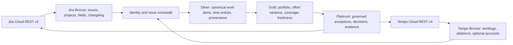

# Jira Cloud and Tempo Timesheets integration scope

19 September 2026 · Design scope and pilot implementation status.

The repository now includes tenant-bound OAuth connection screens, read-only
paginated Jira/Tempo clients, encrypted generic Bronze capture, source registry
adapters, and initial Silver issue/worklog mapping. The first pilot is limited
to one paired site/account per tenant. This implementation has not been
validated against a customer sandbox. The phased exit criteria below remain
gates for a general launch, especially timezone-aware period reporting,
durable workers and deep links.

**Status, 28 September 2026 (verified against code).**

- **Tempo deletion reconciliation is built** (`f2ff6d3`). It is opt-in per tenant
  (`TempoReconciliation:EnabledTenantIds`) and never infers a deletion from absence.
- **The phase 3 report is built** at `/staffops/reporting/jira-tempo`
  (`JiraTempoReconciliationCalculator`). It shows:
  - Tempo hours split three ways, which always add up to the total: linked to
    a synced issue, issue not synced, and no issue. Also hours from people
    not yet matched.
  - Per synced project: open issues with no time, and estimate overruns
    against all recorded time.
  - Unlinked hours by Jira issue id.
  - A failed or never-published source stated first, never shown as zero.
- **The report exists only for a tenant with Jira or Tempo data.** Without
  either, the Reporting tab is hidden and the URL returns 404. Its sections
  follow the data, not the connections: Jira only, Tempo only, or both.
  Keeping unlinked issue ids needed one Silver column,
  `TimeEntry.SourceWorkItemExternalId` (ProgrammeOps step 28).
- **Tempo without Jira issues uses an identity-only Jira connection.** The
  Tempo sync namespaces worklogs and people by the Jira site's `cloudId`, so
  Tempo still needs a Jira connection for the same site. But that connection
  may now select **no projects**: it uses the same read-only OAuth and site
  check, stores an empty project list (a missing list still means "reconnect"),
  and its sync fetches nothing and publishes a run that says so. The report
  then shows every Tempo hour as unlinked, and says Jira is connected for
  identity only. Adding projects later links those hours on the next syncs.
  This was chosen over resolving `cloudId` from the site's public
  `_edge/tenant_info` endpoint, which would add an outbound host and an
  unauthenticated lookup.
- Still open: timezone-aware periods (the report uses Tempo's work date),
  deep links, durable workers, multi-site, and any live sandbox run.

## Product outcome and initial boundary

Programme Pulse should read from the tools customers already use, preserve source links and authority, and add a governed portfolio view. The first supported pair is **Jira Cloud + Tempo Timesheets Cloud**, read-only. Jira Data Center, Tempo Data Center, Tempo Planner and Tempo Financial Manager have different API and permission contracts and are separate later decisions. Tempo may be absent; Jira can still provide work progress. Jira may be absent; Tempo worklogs can still be captured, but issue-level reporting remains unlinked until a Jira connection or approved crosswalk exists.

This is an additive Bronze ingestion plan, with explicit Silver, Gold and Platinum outcomes. No customer must migrate issues, worklogs or users into Programme Pulse to use it. Programme Pulse remains a derived reporting and decision workspace; edits stay in the source tools in the first release.

## Current fit and required change

The code already has `ISyncSource`, a source registry, per-tenant source connections, `SyncRunCoordinator`, Bronze raw payloads for ClickUp and Hub Planner, tenant-keyed Silver upserts and Gold reporting. Jira and Tempo each get their own adapter and sync source. The source registry and controller need no source-specific branch; `ProgrammeOperationsComposer`, entitlements and the connection UI need additions.

Do **not** treat `ISyncSource` alone as a complete connector contract. `SourceConnection` currently permits one active account per tenant/source; `SourceCredential` only describes an API token and optional workspace; `ExternalIdentityLink` uniqueness assumes that one account; and `TimeEntry.IsBillable` defaults to true. Those assumptions must be addressed before a customer can connect multiple Jira sites or rely on Tempo billability. The existing ClickUp/Hub Planner deployment-wide credential fallback must not be copied into Jira/Tempo. A missing, expired or undecryptable tenant credential must fail closed with a clear connection-health status.

## Layered architecture

The arrows back to Jira and Tempo are **deep links only** in phase one, never write API calls. Bronze keeps raw source facts; Silver stores normalized facts and explicit unresolved links; Gold calculates only supported measures; Platinum adds reviewable decisions and ownership. Platinum is a proposed product layer, not a table or service in the current codebase.

## API and connection contract

| Source | Initial extraction | Authentication | Required behavior |
|---|---|---|---|
| Jira Cloud | Selected projects and issues via REST v3 enhanced JQL search; selected field/status metadata; optional issue changelog for transitions | Tenant-owned Atlassian OAuth 2.0 (3LO), minimum read scopes and the user's Jira project permissions | Store Atlassian `cloudId`, selected project IDs, field mapping version and last completed cursor. Page with `nextPageToken`; request only needed fields. Search results can lag writes, so overlap the update window and upsert idempotently. |
| Tempo Timesheets Cloud | Worklogs through `/4/worklogs`, plus deleted-worklog audit events where permission is granted | Tenant-owned Tempo OAuth 2.0; restricted read token only for a tightly controlled pilot | Store Tempo account identity and its linked Jira `cloudId`. Page to completion; `updatedFrom` is an update timestamp and cannot be combined with other filters. Use a safety overlap and deduplicate by stable Tempo worklog ID. |

Jira's [REST v3 introduction](https://developer.atlassian.com/cloud/jira/platform/rest/v3/intro) recommends OAuth 2.0 for integrations; the [enhanced JQL search](https://developer.atlassian.com/cloud/jira/platform/rest/v3/api-group-issue-search/) uses `nextPageToken` and enforces project and issue permissions. Tempo documents [OAuth applications](https://help.tempo.io/timesheets/latest/using-oauth-2-0-authentication), [worklog pagination and `updatedFrom`](https://help.tempo.io/cloudmigration/latest/worklog-rest-apis-for-jira-cloud), and [deleted-worklog audit events](https://apidocs.tempo.io/audit/). Exact scopes and product availability must be verified against the design partner's tenant before enabling a connector.

Connection setup must perform a permission and capability probe, show the selected site and projects, record token expiry/rotation status, and never display the token again. OAuth state, PKCE where supported, redirect URI and token refresh must be bound to the initiating tenant and admin session. Secret material belongs in a persistent managed secret store or encrypted with a persistent shared Data Protection key ring; it must not appear in logs, raw Bronze records, URLs or audit detail JSON. Restrict outbound hosts to Atlassian and Tempo endpoints; do not accept arbitrary customer-provided API base URLs.

## Data contract by layer

| Layer | Jira | Tempo | Acceptance rule |
|---|---|---|---|
| Bronze | Per issue/project/field payload, source ID, `cloudId`, connection key, fetch time, source update time, page/run ID and schema version | Per worklog payload, Tempo ID, Jira worklog/issue IDs where present, account ID, `updatedAt`, date/time and deletion event | Raw facts are tenant scoped, encrypted if sensitive, bounded by retention, and replayable with a documented mapping version. An API permission failure cannot be interpreted as “all rows deleted.” |
| Silver | Jira issue → `WorkItem`; selected project → `Project` only through an approved hierarchy rule; status → lifecycle stage with raw status retained; estimate in **hours only** when the Jira field truly represents time | Tempo worklog → `TimeEntry`; join by `(tenant, Jira cloudId, Jira issue ID)`, then person by Atlassian account ID via an approved `ExternalIdentityLink`; unknown issues/users enter a reconciliation queue | Stable external keys include tenant **and connection/site**. Story points stay separate from hours. Preserve seconds, work date, timezone and unknown billability; do not default missing billability to true. |
| Gold | Open/blocked/overdue work, milestone movement, estimate coverage and source freshness | Actual hours by period, mapped/unmapped hours, approved billable hours only where field meaning is confirmed | Tempo is the **time authority** for a paired Jira+Tempo connection. Jira worklogs are excluded from the same metric to prevent duplicates. Show numerator, denominator, last complete run and partial-data warning. |
| Platinum | Exception: blocked/overdue work or changed commitment, source link and owner | Exception: unlinked time, stale sync, missing approval or variance | Human review, decision, owner, evidence link, time and audit trail. Suggestions never silently change Jira/Tempo or claim an unverified business outcome. |

### Cross-source identity and time ownership

1. Pair one Tempo connection with the exact Jira `cloudId` it belongs to. Reject a mismatched site before publication. Extend the connection/identity key to include account/site before allowing a tenant's second Jira site.
2. Jira issue **ID** is the join key; issue keys can change. Tempo worklog ID is its own identity; preserve Jira worklog ID when supplied for reconciliation and deduplication. Never match by issue title, project name or user display name.
3. Map Atlassian account IDs to staff through explicit, tenant-scoped links. Reuse the existing unresolved-identity queue; require approval for ambiguous identities. Tempo advises account ID over display name, and its worklog timezone behavior needs care: use source work date and time plus the user's timezone for period reporting where necessary. See [Tempo's worklog guidance](https://help.tempo.io/timesheets/latest/querying-and-exporting-worklogs-via-api).
4. Set one time authority per connected Jira site. If Tempo is enabled, do not import the same Jira worklogs as another actual-time source. If Tempo is later disconnected, switch authority through an audited reconciliation step, not by summing both histories.
5. Handle amended and deleted worklogs. Use Tempo's deletion audit feed when available; where unavailable, expose incomplete deletion coverage and reconcile a bounded historical window. A missing permission or partial page must never trigger mass deletion.

## Gold and Platinum product rules

The first management view should answer: “What changed in delivery, how much time was actually recorded, what is unmapped, and when was each source last complete?” Each KPI needs source, filter period, units, coverage and drill-through to Jira/Tempo. A Jira issue marked Done is a workflow state, not customer acceptance. Tempo hours are effort, not revenue. Story points are not converted to hours. Tempo billable time is not recognized revenue. Costs and margin remain behind the existing commercial permission boundary and require separately governed rate and contract inputs.

Platinum should start with a **review queue**, not a predictive score: unmapped people/issues, stale data, blocked milestones, variance above an agreed threshold and missing approval. A reviewed exception records owner, decision, source evidence, snapshot version and timestamp. AI summarization may be added later only on top of this evidence, with a human reviewing any consequential recommendation.

## Operational and security design

- Reuse tenant/source leases, run state, audit and bounded retries. Jira rate limits include quota and burst controls; honor `Retry-After`, use jitter, request limited fields and avoid an unbounded per-issue fan-out. [Atlassian rate-limit guidance](https://developer.atlassian.com/cloud/jira/platform/rate-limiting/).
- Move long syncs to a durable queue/worker before general availability. A web request should create a run request and return its status URL; it should not own the vendor fetch. Persist checkpoints only after complete pages and publish only after mapping and validation pass. The current Silver writes can be partial on failure, so Gold must continue showing that state until a consistent publication mechanism is added.
- Apply per-tenant project selection and least privilege at both connector and repository boundaries. Tenant role, entitlement, connection ownership and selected project scope are separate checks. Raw issue descriptions/comments and worklog descriptions may contain personal data; exclude them unless a customer use case requires them.
- Track freshness, cursor age, 401/403, 429, unmapped count, duplicate count, missing permissions, token expiry, page count and lag. Alert operators without logging payloads or tokens. Rehearse key-ring restoration, credential rotation and interrupted runs.
- Use a per-source retention policy for Bronze and deletion/audit evidence. Confirm customer data processing terms, residency and retention with the design partner before importing personal data.

## Phased implementation and exit criteria

| Phase | Deliverable | Exit test |
|---|---|---|
| 0 — partner discovery | One Jira Cloud and Tempo Cloud sandbox; inventory selected projects, workflow/status fields, estimate unit, Tempo scopes, timezone and billability semantics | Signed mapping sheet and read-only API probe; no production data. |
| 1 — connections and Bronze | Tenant-bound OAuth/secret storage; Jira and Tempo API clients; paginated capture, cursors, deletion feed, retry and health UI | Token isolation, pagination, 401/403/429, expiry and interrupted-page tests; raw payloads never cross tenants. |
| 2 — Silver reconciliation | Jira hierarchy/status mapper; Tempo worklog mapper; account/site-qualified identity and issue links; unresolved queues; nullable/explicit billability | Same issue/worklog from two tenants stays separate; duplicate and deleted worklogs reconcile; story points never become hours. |
| 3 — Gold | Source-aware dashboards, actual-time authority, coverage/freshness and partial-publication labels | Paired Jira+Tempo fixture counts hours once; unlinked hours remain visible; denied/partial source cannot report a healthy zero. |
| 4 — Platinum pilot | Exception queue, owner, decision, evidence and source deep links | A human can trace each surfaced decision to a source fact and audit event; no write-back. |
| 5 — scale | Durable workers, backfill/replay, multi-site support, support runbooks and load tests | Restart/recovery, rotation and two-tenant concurrency pass in a production-like environment. |

**Initial vertical slice:** one tenant, one Jira Cloud site, one Tempo Timesheets account, a small selected project set, issue status/estimate/assignee plus Tempo worklogs. Deliver the paired effort report with a visible unmapped queue and source deep links before adding changelog, accounts, planning or commercial data. Relative size is **large** because OAuth, cross-source reconciliation and customer-specific status mapping dominate the work; no calendar estimate is defensible until the phase 0 probe.

## Decisions needed before implementation

1. Which design partner and Jira/Tempo Cloud products are in the first pilot? Confirm whether Tempo means Timesheets only.
2. Is Jira OAuth 3LO and Tempo OAuth acceptable to the customer's administrators, and which read scopes can they approve?
3. Which Jira projects and issue types represent delivery work, and which field stores an hour-based estimate?
4. Does the buyer need approved/billable Tempo hours in the first report, or only total recorded effort?
5. What are the agreed Bronze retention and data residency requirements?

These answers tune the first mapping and permissions. They do not change the core architecture: two tenant-owned read connections, provenance-preserving Bronze, governed Silver joins, source-aware Gold, and a human-reviewed Platinum layer.
