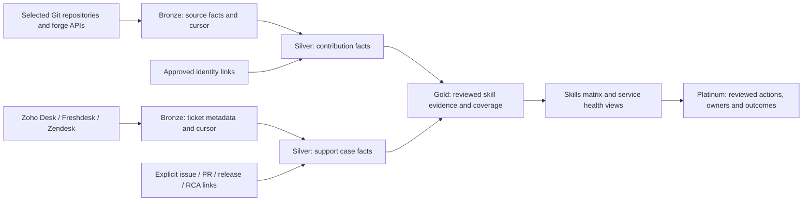

# Staff skills and engineering evidence module

20 September 2026 · Proposed design.

**Build status (20 September 2026).** Phase 1 / Slice 1 — the manually
reviewed, tenant-scoped skills matrix — **is implemented**: `SkillKind`,
`ProficiencyLevel` + rubric, `SkillDefinition`, append-only
`StaffSkillAssertion`, the `SkillsEvidence_*` tables and migration plan,
`/staffops/skills` (self, review, portfolio, coverage, taxonomy), six new
capabilities with persona contracts updated, audit, and GDPR
export/erasure via `IStaffDataParticipant`. See `CLAUDE.md` §7,
`docs/tenancy.md`'s enforcement matrix and `docs/gdpr.md`.

Phase 2 / Slice 2 — repository evidence — **is implemented, and has never
run against a live GitHub App installation.** The provider-neutral
contract (`EngineeringEvidence`, `EvidenceActorLink`,
`UnmappedEvidenceActor`, `EvidenceCoverage`, `EvidenceConnection`), the
`SkillsEvidence_*` tables and indexes, the GitHub Bronze client and
mapper, incremental cursors with partial-coverage tracking, explicit-link
identity mapping with a visible queue, bot exclusion, path-based language
hints and the evidence portfolio all exist and are tested against
fixtures and a real database. What has **not** happened is a token
exchange with a real GitHub App: `SkillsEvidence:GitHubAppSlug`,
`:GitHubClientId` and `:GitHubClientSecret` are unset on every
environment, so no tenant can complete an installation yet. The
application says so itself —
`EvidenceCoverageSummary.IsUnverifiedReplay` is true until a run
completes cleanly, and the portfolio and connection pages carry a
"fixture or sandbox replay" banner while it is.

Phase 3 / Slice 3 — support desk evidence — **is implemented for
Freshdesk, and has never run against a live desk.** `SupportCaseFact`,
`SupportCodeLink`, `SupportCaseParticipant`, `DeskAgentLink`,
`DeskCoverage` and the `ServiceOps_*` tables exist, with the Freshdesk
Bronze client, watermark-and-overlap incremental ingest, the reviewed
root-cause lifecycle and a component service view at `/staffops/service`.

**Freshdesk is the first adapter, not Zendesk.** This page suggested
Zendesk as the reference because it has a documented cursor export; the
customer's desk is Freshdesk, which paginates by `updated_since` and
page number instead. Two consequences are handled explicitly rather than
hidden: the watermark is rewound by a deliberate overlap on every run
(the filter is second-granular, so ties at the boundary would otherwise
be dropped), and a run that exhausts its page budget advances the
watermark and reports **partial** rather than claiming it reached the
end. Both are safe only because the case upsert is idempotent on
`(tenantId, connectionKey, externalTicketId)`.

Field mapping still needs confirming against a live tenant, as this page
requires: which Freshdesk field the customer actually uses for the
product/component tag, and their custom status values. The adapter tries
the conventional fields in order, preserves the raw value, and treats an
unrecognised status as Active rather than dropping the case.

Phase 4 / Slice 4 — reviewed coverage and GTM readiness — **is
implemented, except the part that needs a design partner.**
Manager-approved component ownership, approved backup cover, the
Platinum action layer (owner, rationale, evidence snapshot, follow-up
outcome), the key-person coverage view and the pre-enablement check all
exist. The customer's lawful basis, worker notice and DPIA decision are
recorded as a first-class record and **gate evidence collection**:
`GitHubEvidenceIngestionService` refuses to run without a current one,
so the requirement is a property of the software rather than a sentence
in a document. The approved GTM claim and its explicit non-claims are in
[`skills-evidence-gtm-claims.md`](skills-evidence-gtm-claims.md).

**No design-partner validation has been run**, and it cannot be: it
needs a partner, a live connector and real data, none of which exists.
[`skills-evidence-validation-protocol.md`](skills-evidence-validation-protocol.md)
is the protocol for one, with the known false-positive modes documented
from the code's actual behaviour — squash merges, pair work, force
pushes, inherited code, non-code support demand and unknown component
tags. What fixtures cannot tell us is how *often* each occurs in a real
repository, and that frequency is the whole question.

Phase 5 / Slice 5 — optional suggestions — **is implemented.** Two rules
fire over evidence already collected: a repeated language hint in a
skill the tenant tracks proposes a skill tag, and a component with an
owner and no approved cover proposes a coverage action. Each carries a
confidence band, a rationale somebody can disagree with, citations back
to source, and the window it was drawn from.

**The ceiling on acceptance is the point of the slice.** Accepting a
skill suggestion creates a *self-declared, Submitted* assertion at
Awareness — the weakest thing the domain can express — which then goes
through the same review as a hand-typed declaration, and is refused
outright if the person already has a record for that skill, so it can
never raise an existing level. Accepting a coverage suggestion raises an
action with an owner the manager chooses; it nominates nobody as cover.
There is no path from a suggestion to a confirmed root cause or a
validated proficiency, and `SuggestionService` cannot reach the Service
Ops namespace at all.

Confidence is a band, not a percentage — these are threshold counts over
evidence, and a percentage would imply a calibrated model that does not
exist. Dismissals are kept so the same proposal is never re-raised: an
engine that nags is one people learn to ignore.

**Remaining:** the desk adapters this page names beyond Freshdesk (Zoho
Desk, Zendesk), provider-specific Git forge adapters beyond GitHub, and
the live-vendor and design-partner validation above.

## Decision and product outcome

Build a tenant-scoped skills matrix that combines a staff member's declared skills, manager-validated proficiency and optional evidence from approved repositories. Add support desk evidence to show product and team learning, service health and incident resolution. The product should answer:

- Who has demonstrated experience with a language, component or service, and what evidence supports it?
- Where would delivery depend on one person, and who could provide cover or benefit from training?
- Which components create repeat support demand, and are fixes reducing that demand?

Do not create an automatic individual "developer value", "quality" or maturity rank. Commit volume, lines changed, ticket count and repository language distribution are poor proxies for proficiency or the quality of someone's work. Make contribution evidence visible and reviewable; keep employment decisions with people who can consider context. Support demand belongs first to a product/component and owning team. Attribution to a code change requires a reviewed root-cause link, not a nearby commit or `git blame` result.

The current `StaffProfile` has free-text job title, department and team, but no skill taxonomy or proficiency record. [The existing maturity review](archive/solution-maturity-reassessment-2026-09-16.md) proposes a tenant-scoped skills table with admin entry first. `ExternalIdentityLink` already provides a tenant-scoped, admin-approved pattern for connecting external users to staff; this module must extend its account/connection key before supporting multiple accounts of the same provider per tenant. These are starting points, not evidence that the new module exists.

## Architecture

**Bronze** captures tenant, source account, selected repository or desk, external ID, source timestamp, fetch timestamp, run ID, cursor and schema version. Request only the fields needed for the approved use case. Store raw API payloads only when replay is necessary, encrypted and with short retention; do not ingest source code, ticket bodies, attachments or customer contact details by default. Failed pages and permission changes must mark coverage partial, not delete previously known facts.

**Silver** holds canonical, versioned facts: merged PR, authored commit, review, documentation contribution, support case metadata, incident resolution and confirmed issue/PR/release relationships. Keep the actor's source ID separate from `StaffKey` until an explicit approved identity link exists. Track attribution role (`author`, `co-author`, `reviewer`, `resolver`), source URL, evidence date, confidence and mapping status. One person can have several roles; one artifact can involve several people. Bots and service accounts are excluded from staff attribution.

**Gold** offers evidence portfolios, service/component trends and key-person coverage. A skill is a human assertion with a review date; activity can suggest a skill for confirmation but cannot silently change proficiency. Show the observation window, denominator, source coverage, unmapped actors, stale syncs and exclusions. A coverage warning can say "one verified maintainer and no reviewed backup for this component"; it must not label that person high or low value. A support case only contributes to a person's evidence when their documented role is linked, such as reviewer of a fix or incident resolver.

**Platinum** records reviewed decisions: nominate a backup, pair on a component, document a runbook, investigate a recurring defect, or offer training. Record owner, rationale, source evidence, decision time and follow-up outcome. No automatic staffing or employment decision.

## Source adapters and first pilot

| Source | First pilot data | Connection and quality rule |
|---|---|---|
| GitHub | Selected repositories, default-branch commits, merged PRs, changed file paths, reviews and links to issues/releases | Tenant-approved, read-only GitHub App installation limited to selected repositories. Use stable GitHub account IDs and commit author/committer identities as distinct facts. A GitHub PR author or reviewer is stronger evidence of participation than repository-wide language bytes. Exclude generated/vendor files and language detection uncertainty. |
| Generic Git / other forges | Commit identity, hashes and changed paths; later provider-specific PR and review adapters | A generic repository can provide contribution history, but not necessarily review or deployment context. Do not present its evidence as equivalent to a GitHub PR. Do not clone arbitrary untrusted URLs into the web application. |
| Zendesk | Ticket ID, updated time, status, priority, product/component tags and explicit linked issue/incident IDs | Use cursor-based incremental ticket export; persist cursor only after the full page is stored. Respect provider rate limits and deletion events. |
| Freshdesk | Ticket ID, updated time, status, priority, product/component tags and explicit linked issue/incident IDs | Use updated-since pagination with overlap and idempotent upsert; confirm tenant permissions and the vendor's supported tenant authorization method during pilot setup. |
| Zoho Desk | Ticket ID, modified time, status, priority, product/component tags and explicit linked issue/incident IDs | Use organisation-bound OAuth with the smallest ticket-read scope; bind and verify the selected organisation/account on each sync. |

Start with **one GitHub organisation and one support desk chosen by the pilot customer**, then add the other two desk adapters behind the same Silver contract. A customer can connect a desk without connecting a repository; that yields service health and team improvement views, not code-cause claims. A customer can connect Git without a desk; that yields contribution evidence and coverage, not support impact claims. Connections are optional and should never require moving work out of the source tools.

Provider contracts to verify during implementation: [GitHub commit API](https://docs.github.com/en/rest/commits/commits), [GitHub PR and review APIs](https://docs.github.com/en/rest/pulls/pulls), [Zendesk incremental export](https://developer.zendesk.com/api-reference/ticketing/ticket-management/incremental_exports/), [Freshdesk API](https://developers.freshdesk.com/api/), [Zoho Desk API](https://desk.zoho.com/DeskAPIDocument). The provider documentation establishes available extraction paths, not a claim that these integrations are live.

## Data contract and attribution

Proposed tenant-scoped tables or equivalent domain records:

| Record | Required fields and invariant |
|---|---|
| `SkillDefinition` | `(tenantId, skillKey)`, name, type (`language`, `framework`, `component`, `practice`, `domain`), taxonomy version and active state. Alias mappings are reviewed, never inferred from filename alone. |
| `StaffSkillAssertion` | `(tenantId, staffKey, skillKey)`, proficiency rubric, declared/validated source, evidence window, reviewer, review date and expiry/review-due date. Preserve assertion history rather than overwriting it. |
| `EngineeringEvidence` | `(tenantId, connectionKey, sourceType, externalId, role)` unique; event time, repo/component, source URL, language hints, attribution status and run/version provenance. No raw diff or code body. |
| `SupportCaseFact` | `(tenantId, connectionKey, externalTicketId)` unique; created/updated/resolved times, status, priority, product/component, reopen marker, limited category, source URL and deletion state. No ticket body or requester identity in Silver. |
| `EvidenceActorLink` | Evidence key, external actor ID, approved staff key or unresolved state, role, approver and timestamp. Ambiguity goes to a review queue; name/email matching alone cannot publish person-level evidence. |
| `SupportCodeLink` | Ticket/incident key, linked issue/PR/commit/release, link method (`explicit`, `confirmed RCA`), reviewer, confidence and timestamp. Only confirmed RCA can label a code change as causal. |

Changes to repository or support permissions can remove access; mark prior evidence stale or out of coverage. A force push, squash merge, cherry pick, pair-programming session or inherited component can break simple commit-to-person claims. Preserve PR authors, co-authors and reviewers where available and show unknowns. A commit's author and co-author fields are free text, so anyone can name a colleague: a commit row shows verified authorship only when the provider verified its signature **and** the author is that signer (`EngineeringEvidence.AuthorshipVerified`, schema version 2, SkillsEvidence step 06). Every other commit row, including every co-author trailer, commits ingested before step 06 and every Azure DevOps commit (this integration reads no signature verification from it), is kept and labelled "authorship not verified" on the portfolio, My Skills and contribution-review pages. Pull requests and reviews are made from the person's own account and are not labelled. Language evidence means "participated in changes to files classified as this language during this period," not "is proficient." Reviewed proficiency uses a rubric, examples of delivered work and a human conversation. Quality examples should be evaluated in context: reviewed design, tests, maintainability, incident follow-through, documentation and peer feedback. The system should not calculate a single individual quality score.

An explicit Jira issue key in a ticket and PR is a **relationship**, not proof that the PR caused the ticket. A confirmed root-cause assessment can make that claim, with a reviewer and an audit trail. A person who fixed a defect can receive positive resolution evidence without being labelled responsible for the defect. Dashboard trends should use comparable exposure windows and case severity; distinguish new defects, inherited issues and support requests unrelated to code.

## Views and measures

| View | Useful evidence | Required context |
|---|---|---|
| Staff skill portfolio | Validated skill assertions, selected merged work, reviews, incident fixes and documentation with source links | Show the person's role, observation period and whether the assertion was self-declared or reviewed. Let staff correct attribution and add work done outside connected repositories. |
| Key-person coverage | Number of validated maintainers and reviewed backups per component; recent review and runbook participation | Require a manager-owned component map. A single contributor is a continuity risk for the business, not a judgement about that contributor. |
| Engineering practice | Review coverage, tests and documentation associated with selected changes; follow-through on confirmed defects | Present examples for human discussion, with role and workload context. Do not derive a score from approval count, line volume or tests touched. |
| Service maturity | Recurring case themes, reopen rate, time to restore service, confirmed defect trend and completed improvement actions | Compare like products, periods, severity and customer exposure. Show missing component tags and unlinked tickets; a support case does not imply code failure. |

These views should highlight uncertainty as prominently as results. A manager may identify a hidden expert or a training opportunity from them, but the source data cannot establish an individual's overall worth to the organisation.

## Security, privacy and access

- Tenant, connection and external ID together scope every source key, cursor, raw record and Silver upsert. Use the existing fail-closed tenant context and connection credential patterns. Keep provider credentials encrypted with the persistent key ring or managed secret store; never put them in URLs, logs or evidence records.
- Source grants are read-only and restricted to selected repositories/projects/desks. Validate provider hosts and OAuth state/redirect binding. Keep sync work outside the request path, with bounded pagination, rate-limit backoff, per-tenant leases and complete-run publication status.
- Roles are separate: connection admin can configure sources; skills reviewer can validate assertions; staff can inspect and challenge their own evidence; a delivery manager sees team coverage; ordinary users do not receive raw employee-level activity. Audit every identity link, skill validation, RCA and export.
- Define retention separately for raw payloads, normalized evidence and reviewed assertions. Apply correction, unlink, source deletion and staff erasure across derived records and exports. A disconnected source must not leave an apparently current claim.
- Before a customer enables person-level collection, document purpose, lawful basis, proportionality, notice to staff, retention and a DPIA decision with the customer's privacy/HR owners. The [ICO worker-monitoring guidance](https://ico.org.uk/for-organisations/uk-gdpr-guidance-and-resources/employment/monitoring-workers/data-protection-and-monitoring-workers/) calls for transparency and a DPIA where processing is likely high risk. Any later use for performance or employment decisions requires a separate approved purpose and safeguards.

## Delivery order and release gates

1. **Foundation:** agree the skill taxonomy and proficiency rubric with a design partner; add manual/self-declared assertions, manager review, staff view/correction and access controls. Release only when tenant isolation, audit, retention and export/erasure are verified.
2. **Repository evidence pilot:** add a selected-repository GitHub connection and read-only incremental evidence. Require explicit staff identity links, bot exclusion, a complete sync indicator, PR/review and contribution roles, and source drill-through. Validate a sample against the repository and staff with known pair/squash workflows. No automatic score or skill upgrade.
3. **Support pilot:** connect the customer's chosen desk, import metadata only, show case demand and recurrence by component/team, and add a review queue for explicit issue/PR/release/RCA links. Validate deletions, reopens, partial pages, rate limits and support cases unrelated to code.
4. **Multi-provider and coverage:** add the remaining desk adapters and provider-specific Git forge adapters as demand justifies. Publish key-person coverage and training recommendations only after a manager validates component ownership and backup coverage.
5. **Optional suggestions:** propose skill tags and component/case relationships with confidence and citations; require human acceptance before they become assertions or causal links. Do not use suggestions for automatic employment decisions.

The GTM claim after phases 1–3 can be: "Programme Pulse combines reviewed staff skills with optional repository contributions and support trends to help teams find expertise, plan cover and improve services." Do not claim that it measures developer value, proves code quality, identifies who caused a ticket, or predicts individual performance.

## Gaps against this design (21 September 2026)

The build-status header above says which *phases* landed. This section is
the other direction: things **this page asks for that the code does not
do**, found by reading the document back against the shipped module. The
phase notes already cover the two absences everyone knows about — no live
vendor run and no design partner — so they are not repeated here.

### The two component maps are unconnected

The largest gap, and the one that limits the product rather than a
feature. This page's headline questions span code and support, but the
module keeps two unrelated `componentKey` namespaces:

- `ComponentOwnership.ComponentKey` — manager-declared, reviewed, used by
  key-person coverage and the action layer.
- `SupportCaseFact.ComponentKey` — derived from a ticket tag, used by the
  service view.

`ServiceHealthQueryService` groups by the ticket tag alone and
`KeyPersonCoverageQueryService` never reads Service Ops, so "this
component generates repeat demand *and* has one maintainer and no backup"
cannot be asked. Closing it means a tenant-scoped component registry that
both sides resolve against, with the desk tag as a reviewed alias — not a
string join, which would silently mis-attribute demand.

Three further gaps fall out of this one: the Platinum action layer is not
reachable from a desk component, so "completed improvement actions" is
missing from the service maturity view; recurring **case themes** are not
derived at all (the view reports counts, reopens, median time to restore
and confirmed code causes, which is the measurable part); and a coverage
warning cannot yet be weighted by the support load the component carries.

### A confirmed root cause never reaches a person's record

`SupportCodeLink.ArtifactExternalId` is a free string. It is never
resolved to an `EngineeringEvidence` row, so a reviewed RCA on a pull
request does not appear on the portfolio of the person who authored or
reviewed it. Two of this page's statements therefore have no
implementation: "a person who fixed a defect can receive positive
resolution evidence", and the engineering-practice view's "follow-through
on confirmed defects". The guard rails for it are already in place — the
causal claim is reviewed and audited, and `SupportLinkMethod` keeps
relationship and cause apart — so this is a join, not a new policy.

### The engineering practice view does not exist

Row three of the views table. `EngineeringEvidence` carries no test or
documentation signal: `ChangedPathClassifier` classifies language and
excludes generated/vendor paths, but does not mark test or docs paths,
and there is no review-coverage aggregate over `EvidenceRole.Reviewer`.
What exists is the per-person portfolio and per-skill coverage. Worth
building deliberately rather than by accident — this is the view closest
to the scores this page forbids, and it needs the same "examples for
discussion, no derived score" treatment the portfolio got.

### Smaller contract gaps

- **No alias mapping.** `SkillDefinition` has key, name, kind, taxonomy
  version and active state, but no reviewed alias record, so a language
  hint reaches a skill only when the hint string happens to equal the
  skill key. This page's "alias mappings are reviewed, never inferred
  from filename alone" is currently satisfied by having no mapping at all.
- **No structured evidence window on an assertion.** There is
  `EvidenceNote` (free text) and `ReviewDueOn`; the data-contract row asks
  for an observation window, which a reviewer would need to say *when*
  the work being judged happened.
- **Taxonomy version has no migration path.** `SkillTaxonomy.CurrentVersion`
  is stamped on every row and nothing re-stamps or reconciles rows if it
  is ever incremented. Fine at version 1; a trap at version 2.
- **The admin-facing portfolio shows less than the subject sees.** "My
  Skills" includes a person's own support participation; the reviewer's
  view of the same person does not.

### Against the security, privacy and access bullets

- **Raw payloads are retained but not encrypted.** This page asks for
  raw API captures to be "encrypted and with short retention". Retention
  is honoured — `RawPayloadRetentionDays` defaults to 30 and purges after
  every run — but the captures are plaintext JSON in the database,
  following the existing ProgrammeOps pattern. Credentials are protected
  with the key ring; payloads are not. The payloads hold commit messages,
  logins and ticket metadata, so this is worth closing before a live
  tenant, not after.
- **Sync runs in the request path.** This page asks for sync "outside the
  request path, with… per-tenant leases". The lease half is now true:
  GitHub, Azure DevOps and Freshdesk all reuse the shared
  `SyncRunCoordinator` / `ProgrammeOps_SyncLease` / `ProgrammeOps_SyncRun`
  path, so the syncs are multi-instance safe and their admin pages can
  show durable running/failed/last-success state. The queue/scheduler
  half is still open: every run is still an `[HttpPost]` action, not a
  background worker. Also recorded in
  [`data-governance.md`](data-governance.md) §8; restated because this
  page asked for it by name.
- **Correction of a wrong attribution is not self-service.** The subject
  can challenge a skill assertion; correcting a mis-attributed commit
  means asking an Admin to revoke the account mapping. The page says so,
  which is the minimum, but "let staff correct attribution" is only half
  met — and "add work done outside connected repositories" has no route
  at all beyond declaring a skill.

### Still open from the delivery order

Phase 4's remaining adapters (Zendesk, Zoho Desk, generic Git and other
forges) and the live-vendor and design-partner validation described in
the build-status header.
